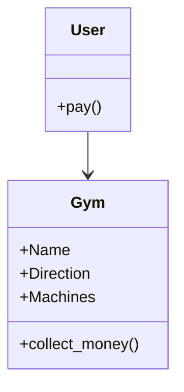

# Reto 2 // Diego Arévalo
Solución del reto dos de Programación Orientada a Objetos
## Diagrama de Clases UML para un gimnasio.
**Relación usuario - gimnasio**

**Relación usuario - gimnasio**
💎
> :shipit: Diego Alejandro Arévalo Guevara. 20 de febrero de 2024.
