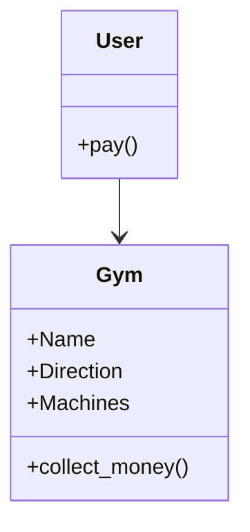
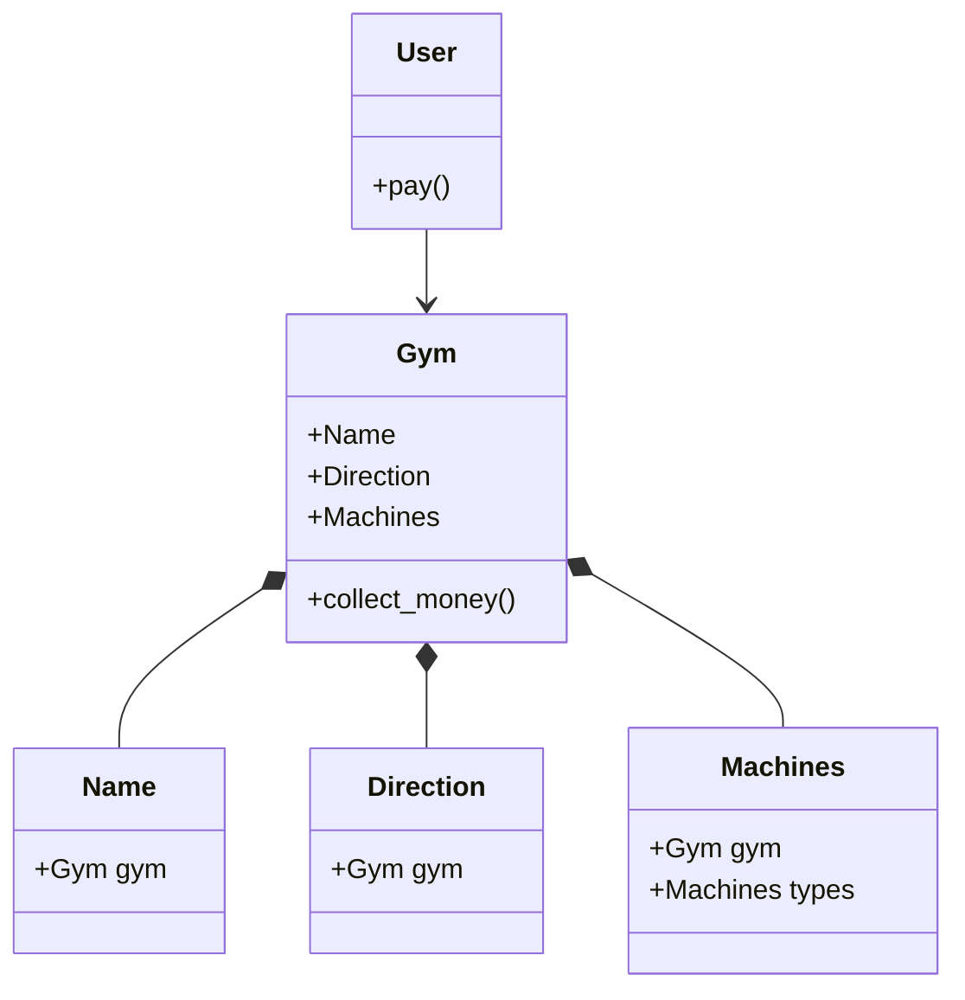
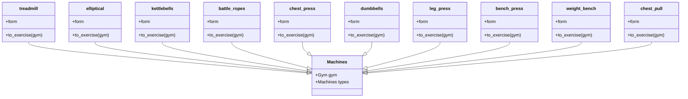

# Reto 2 // Diego Arévalo
Solución del reto dos de Programación Orientada a Objetos
## Diagrama de Clases UML para un gimnasio.
**Relación usuario - gimnasio**

**Relación gimnasio - partes gimnasio**

**Relación entre máquinas**

> :shipit: Diego Alejandro Arévalo Guevara. February 20, 2024.
